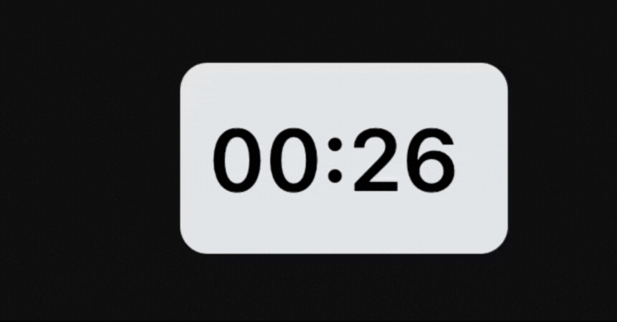

# Time Components 
Contains time related TypeScript React components.

# Available Components
* Timer - a Timer that count runs backward. Can be paused and played on hover.

# Timer

```tsx
import { Timer } from "timerkit";
(<Timer timeInSeconds={20} pauseEnabled={true} />)
```
* A 20 sec timer will run that can be paused when needed.